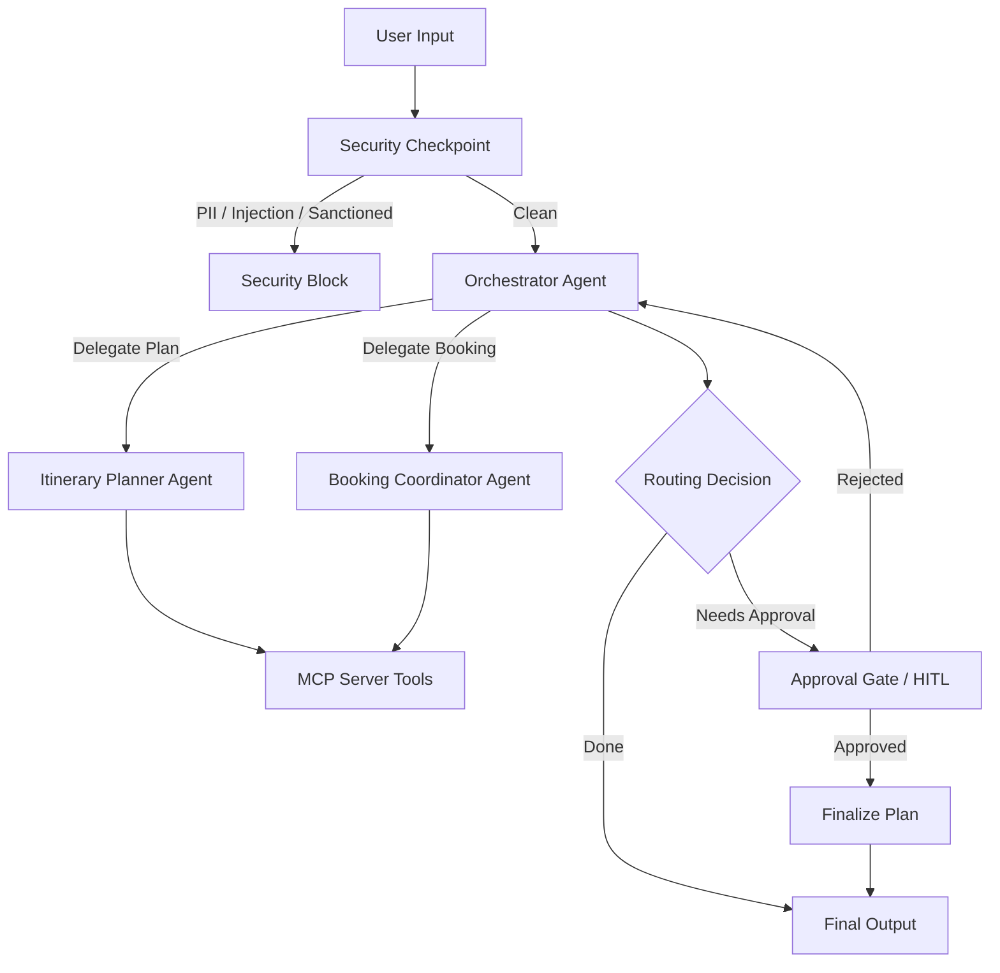

# ZenTravel — Smart Travel Planning & Booking Concierge

ZenTravel is a secure, multi-agent travel concierge that plans customized itineraries, checks weather data, searches for flight/hotel options, and coordinates simulated bookings with built-in human-in-the-loop approval gates.

## Prerequisites
- **Python**: Version 3.11 to 3.14
- **uv**: Python package manager
- **Gemini API Key**: Obtain from [Google AI Studio](https://aistudio.google.com/apikey)

## Quick Start
```bash
git clone <repo-url>
cd zentravel
cp .env.example .env   # Add your GOOGLE_API_KEY
make install
make playground        # Opens interactive UI at http://localhost:18081
```

## Architecture Diagram


## How to Run
- **Interactive UI (Playground)**: `make playground` (runs on http://localhost:18081)
- **Local Web Server**: `make run` (runs the API backend on http://localhost:8080)

## Sample Test Cases

### Test Case 1: Standard Trip Planning & Booking Request
- **Input**: 
  ```text
  Plan a 3-day trip to Tokyo starting 2026-10-10. Check the weather first, search for flights from NY, suggest a hotel, and prepare the booking.
  ```
- **Expected**: 
  * The security checkpoint validates the input as clean.
  * The Orchestrator delegates tasks to the Itinerary Planner and Booking Coordinator.
  * The sub-agents call MCP tools (`get_weather`, `search_flights`, `search_hotels`).
  * The Orchestrator prepares the booking details and triggers the Human-In-The-Loop (HITL) approval gate.
- **Check**: The UI will display a prompt asking for approval:
  `✋ ZenTravel Approval Gate: Please review your booking details: ... Do you approve? (Yes/No)`

### Test Case 2: Security Block (Sanctioned Destination)
- **Input**:
  ```text
  Help me plan a flight and hotel in Cuba for next month.
  ```
- **Expected**: The Security Checkpoint detects "Cuba" as a sanctioned destination, blocks the request, and routes directly to the security failure handler.
- **Check**: The user sees the message:
  `⚠️ Security Block: Travel planning to sanctioned country 'Cuba' is prohibited.`

### Test Case 3: PII Scrubbing
- **Input**:
  ```text
  My passport number is AB1234567 and my email is alice@example.com. Can you check flights from London to Paris on 2026-09-01?
  ```
- **Expected**: The Security Checkpoint scrubs the sensitive passport and email information before passing it to the Orchestrator.
- **Check**: Look at the terminal logs or audit logs (`stderr`) to see the structured JSON scrub event:
  `{"event": "pii_scrubbed", "severity": "WARNING", ...}`

## Troubleshooting
1. **PydanticSchemaGenerationError on `any`**: Ensure `node_input` type hint in `final_output` is removed or typed as `typing.Any` rather than built-in `any`.
2. **Session Not Found / App Name Mismatch**: Verify that the `App(name="...")` instantiated in `agent.py` matches the directory name `"app"` so the runner can locate the session.
3. **429 Resource Exhausted**: Free-tier Gemini API keys have lower rate limits for `gemini-2.5-flash`. Change the model to `gemini-2.5-pro` or `gemini-2.5-flash-lite` in `.env` to bypass this constraint.

## Push to GitHub

1. Create a new repo at https://github.com/new
   - Name: zentravel
   - Visibility: Public or Private
   - Do NOT initialize with README (you already have one)

2. In your terminal, navigate into your project folder:
   ```bash
   cd zentravel
   git init
   git add .
   git commit -m "Initial commit: zentravel ADK agent"
   git branch -M main
   git remote add origin https://github.com/sayanikundu17-sketch/zentravel.git
   git push -u origin main
   ```

3. Verify .gitignore includes:
   ```text
   .env          ← your API key — must NEVER be pushed
   .venv/
   __pycache__/
   *.pyc
   .adk/
   ```

⚠ NEVER push .env to GitHub. Your API key will be exposed publicly.

## Assets

### Cover Page Banner


### Agent Workflow Diagram


## Demo Script
A conversational narration script for presenting the ZenTravel concierge features is available in [DEMO_SCRIPT.txt](file:///c:/Users/SAYANI/Desktop/AI%20Agents/adk-workspace/zentravel/DEMO_SCRIPT.txt).
