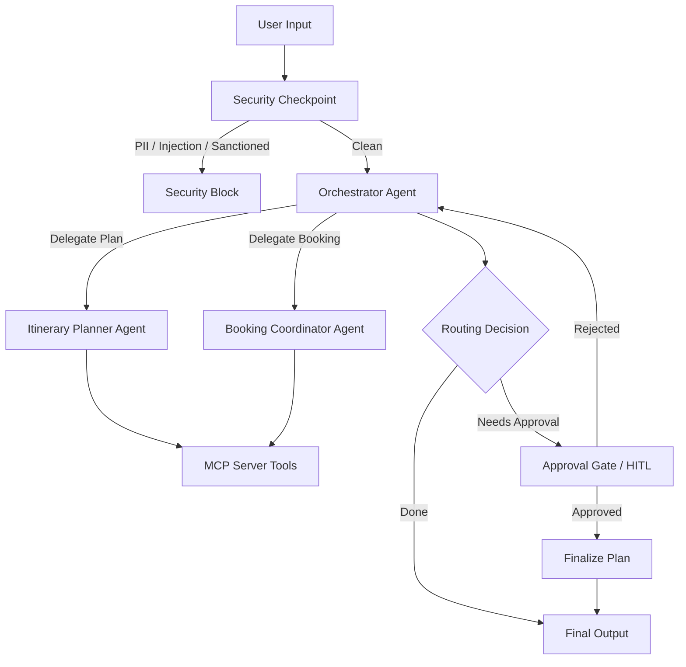

# ZenTravel Concierge Agent Submission Write-up

## Problem Statement
Planning travel can be a tedious and fragmented process. Users often have to jump between search engines, weather sites, booking sites, and note-taking apps to put together an itinerary, check flight/hotel details, and book them. Furthermore, exposing personal data like passport numbers, email addresses, and payment details during planning presents severe security and PII exposure risks.

**ZenTravel** addresses this by providing an integrated, secure travel concierge agent that:
1. Plans custom itineraries based on destination, dates, and live weather.
2. Researches flights and hotels under the hood using standard tools.
3. Automatically redacts PII and blocks malicious injections.
4. Requires explicit human validation before simulating a booking.

---

## Solution Architecture

---

## Concepts Used & File References

- **ADK 2.0 Workflow**: Built as a directed workflow graph mapping transitions between nodes based on conditional routing in [app/agent.py](app/agent.py#L182-L197).
- **LlmAgent**: Used for specialized sub-agents: `itinerary_planner` and `booking_coordinator` in [app/agent.py](app/agent.py#L25-L45).
- **AgentTool**: Handled orchestration-to-subagent delegation, keeping the main orchestrator in control in [app/agent.py](app/agent.py#L47-L72).
- **MCP Server**: Implemented using the MCP Python SDK (`FastMCP`) to host weather, flight, and hotel tools in [app/mcp_server.py](app/mcp_server.py).
- **Security Checkpoint**: Implemented as the entry workflow node checking for injection, PII, and destination restrictions in [app/agent.py](app/agent.py#L74-L138).
- **Agents CLI**: Project scaffolded, managed, and tested using the `agents-cli` toolset.

---

## Security Design

1. **Prompt Injection Guard**: Detects common system override keywords to prevent malicious hijacking of sub-agent instructions.
2. **PII Redaction**: Utilizes robust regex patterns to locate and redact passport numbers, credit cards, and email addresses in user inputs before any LLM processing occurs.
3. **Domain-Specific Country Filter**: Automatically blocks travel planning requests to sanctioned destinations (e.g., North Korea, Iran, Cuba, Syria, Sudan) as a regulatory compliance guard.
4. **Structured JSON Audit Logs**: Writes formatted logs containing event classifications and severity levels (`INFO`, `WARNING`, `CRITICAL`) directly to `stderr` for visibility and tracking.

---

## MCP Server Design

Our custom Model Context Protocol server exposes three key tools:
1. **`get_weather(destination, date)`**: Resolves travel weather conditions for a destination on a specific day, helping the itinerary planner customize suggestions.
2. **`search_flights(origin, destination, date)`**: Searches for realistic flight departures, times, and pricing.
3. **`search_hotels(destination, checkin_date, checkout_date)`**: Fetches hotel options with ratings and nightly rates.

---

## Human-in-the-Loop (HITL) Flow

A `RequestInput` node (`request_approval`) suspends execution whenever a booking is ready. It presents the booking details to the user and pauses for confirmation:
- If the user confirms (`Yes`), the workflow goes to `finalize_plan` and commits the booking.
- If the user rejects (`No`), it routes back to the `orchestrator` to refine or look for alternative options.

---

## Demo Walkthrough
- **Test Case 1 (Booking Flow)**: Confirms the core loop from query -> subagent search -> approval request -> confirmation output.
- **Test Case 2 (Compliance Block)**: Demonstrates the sanctioned country block on a request to "Cuba".
- **Test Case 3 (PII Redaction)**: Verifies that sensitive user details like passport information are safely redacted from the LLM prompt.

---

## Impact / Value Statement
ZenTravel simplifies the trip planning experience by centralizing itinerary generation and travel search in a single conversation. It shields users from exposing PII, enforces compliance regulations automatically, and ensures no bookings are made without explicit, documented user approval.
